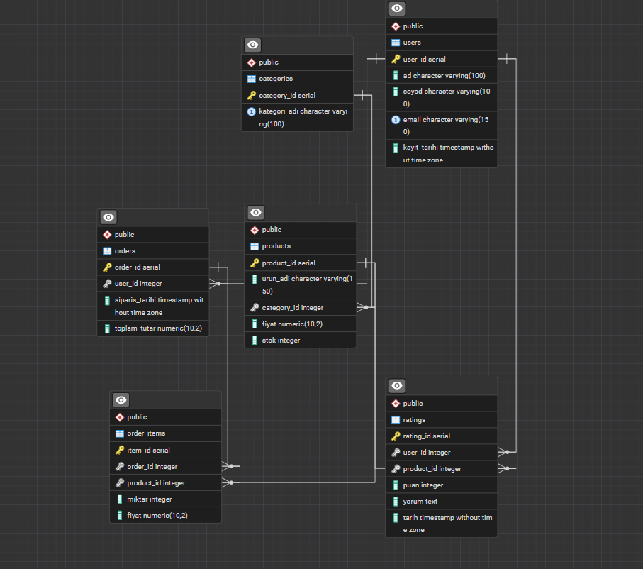

# Veritabanı Şema Tasarımı ve Optimizasyonu

## ER Diyagramı

Aşağıda sistemde kullanılan tablolar ve aralarındaki ilişkiler gösterilmektedir.

---

## Kullanılan Tablolar

- users
- products
- orders
- order_items
- interactions
